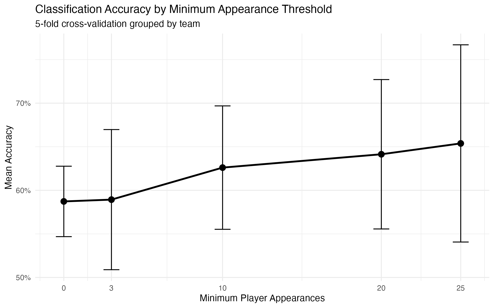
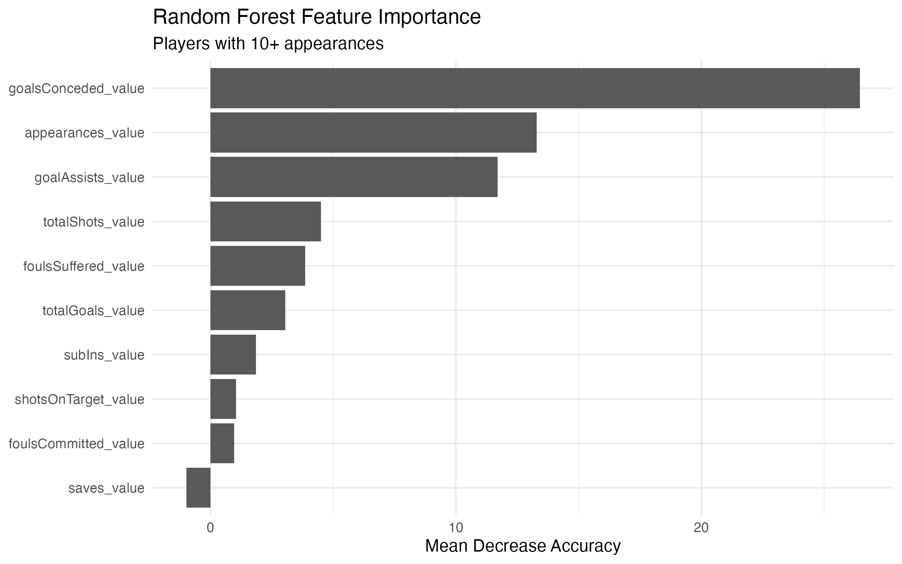
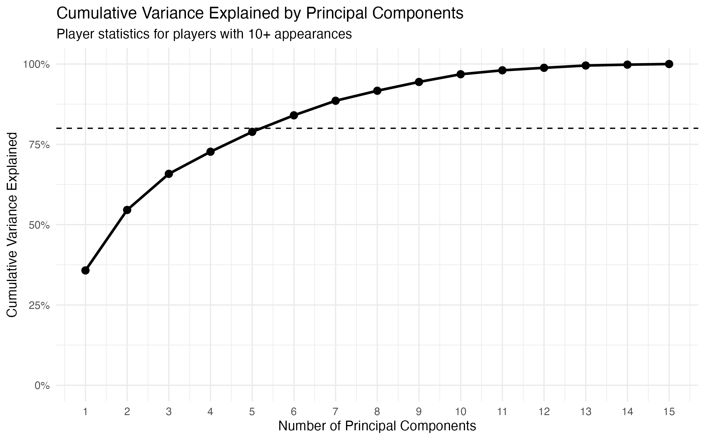

# Soccer Predictive Analytics

An R-based machine learning analysis of the player-level performance characteristics that distinguish Top-10 from Bottom-10 English Premier League teams.

**Data Source:** ESPN Soccer Data API, accessed through the ESPN Soccer Data dataset published by excel4soccer on Kaggle.

## Project Overview

This project investigates whether player-level performance statistics can distinguish teams finishing in the Top 10 versus Bottom 10 of the 2024 English Premier League season.

A Random Forest classifier is trained using 15 player-performance metrics, including goals, assists, shots, appearances, fouls, and defensive statistics. Because players from the same club share a team outcome, validation is grouped by team so that players from the same club cannot appear in both the training and testing sets.

Principal Component Analysis (PCA) is used to investigate redundancy among player statistics, while sensitivity testing examines how individual features influence model performance.

## Key Results

* **Player-level performance:** The selected 10+ appearance model achieved approximately **81% mean accuracy** and **0.89 mean ROC AUC** under team-grouped 5-fold cross-validation.
* **Team-level performance:** Aggregating out-of-fold player probabilities by club produced **70% classification accuracy** and **0.79 ROC AUC** across all 20 Premier League clubs.
* **Feature sensitivity:** `goalsConceded_value` was the dominant Random Forest predictor. Removing it reduced mean player-level AUC from approximately **0.89 to 0.54**.
* **Dimensionality reduction:** The first five principal components explained approximately **79% of the variance** across the 15 player-performance variables.

## Methodology & Analysis

### 1. Team-Grouped Cross-Validation

A random player-level train/test split could place players from the same club in both sets. To prevent team-specific information from leaking into model evaluation, five-fold cross-validation is grouped by club. Each test fold therefore contains only teams excluded from model training.

Performance is evaluated using classification accuracy, ROC AUC, out-of-fold predicted probabilities, and aggregated team-level predictions.

### 2. Appearance Threshold Analysis

Minimum appearance thresholds of 0, 3, 10, 20, and 25 matches are compared to determine whether removing low-usage players improves model performance.

The **10+ appearance threshold** is selected as the final specification because it provides strong player- and team-level discrimination while retaining more observations than the more restrictive alternatives.

Filtering low-usage players substantially improves player-level discrimination. Mean grouped-CV AUC increases from approximately **0.76 with no appearance restriction to 0.89 at the selected 10+ threshold**.

### 3. Random Forest & Feature Diagnostics

A final Random Forest is fit to the selected 10+ appearance population for feature interpretation. Permutation-based feature importance identifies the statistics most heavily used by the model.

`goalsConceded_value` emerges as the dominant predictor. Sensitivity analysis is therefore used to determine how dependent the model's performance is on this feature.

Removing `goalsConceded_value` reduces mean player-level AUC from approximately **0.89 to 0.54**, showing that much of the model's discrimination is driven by this outcome-adjacent same-season statistic.

### 4. Principal Component Analysis

PCA is applied to the standardized player statistics to examine correlation and redundancy among the original predictors.

The first three principal components explain approximately **66%** of total variance, while the first five explain approximately **79%**, demonstrating substantial redundancy among the original 15 performance metrics.

### 5. Team-Level Evaluation

Out-of-fold player probabilities from the selected model are averaged within each held-out club to evaluate whether player-level predictions translate into meaningful team-level separation.

The aggregated predictions achieve **70% classification accuracy** and **0.79 ROC AUC** across the 20 Premier League clubs.

## Interpretation & Limitations

This analysis is a **same-season classification problem, not a prospective forecasting model**. Player statistics from the 2024 season are used to distinguish players belonging to Top-10 and Bottom-10 teams from that same season.

Sensitivity analysis shows that much of the Random Forest's predictive performance is driven by `goalsConceded_value`, which is closely related to team performance and league outcomes. The model's high player-level AUC therefore should not be interpreted as evidence that it can forecast future league standings.

Instead, the project demonstrates the importance of grouped validation, feature diagnostics, sensitivity analysis, and dimensionality reduction when evaluating machine-learning results on grouped sports data.

## Tech Stack

* **Language:** R
* **Machine Learning:** Random Forest (`randomForest`)
* **Validation & Evaluation:** Team-grouped 5-fold cross-validation, ROC/AUC, confusion matrices (`pROC`, `caret`)
* **Dimensionality Reduction:** Principal Component Analysis (PCA)
* **Data Manipulation:** `dplyr`, `readxl`
* **Visualization:** `ggplot2`
* **Reproducibility:** `here`, Git, GitHub
